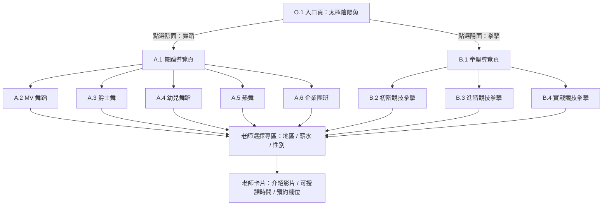

# 榮耀網站 Flowchart

```mermaid
flowchart TD
  O1["O.1 入口頁：太極陰陽魚"]
  O1 -- "點選陰面：舞蹈" --> A1["A.1 舞蹈導覽頁"]
  O1 -- "點選陽面：拳擊" --> B1["B.1 拳擊導覽頁"]

  A1 --> A2["A.2 MV 舞蹈"]
  A1 --> A3["A.3 爵士舞"]
  A1 --> A4["A.4 幼兒舞蹈"]
  A1 --> A5["A.5 熱舞"]
  A1 --> A6["A.6 企業團班"]

  B1 --> B2["B.2 初階競技拳擊"]
  B1 --> B3["B.3 進階競技拳擊"]
  B1 --> B4["B.4 實戰競技拳擊"]

  A2 --> TF["老師選擇專區：地區 / 薪水 / 性別"]
  A3 --> TF
  A4 --> TF
  A5 --> TF
  A6 --> TF
  B2 --> TF
  B3 --> TF
  B4 --> TF

  TF --> TC["老師卡片：介紹影片 / 可授課時間 / 預約欄位"]
```

> 備註：原需求中 A/B 導覽名稱與分類內容互相交叉。本版先以分類內容為準：A 系列為舞蹈，B 系列為拳擊。
